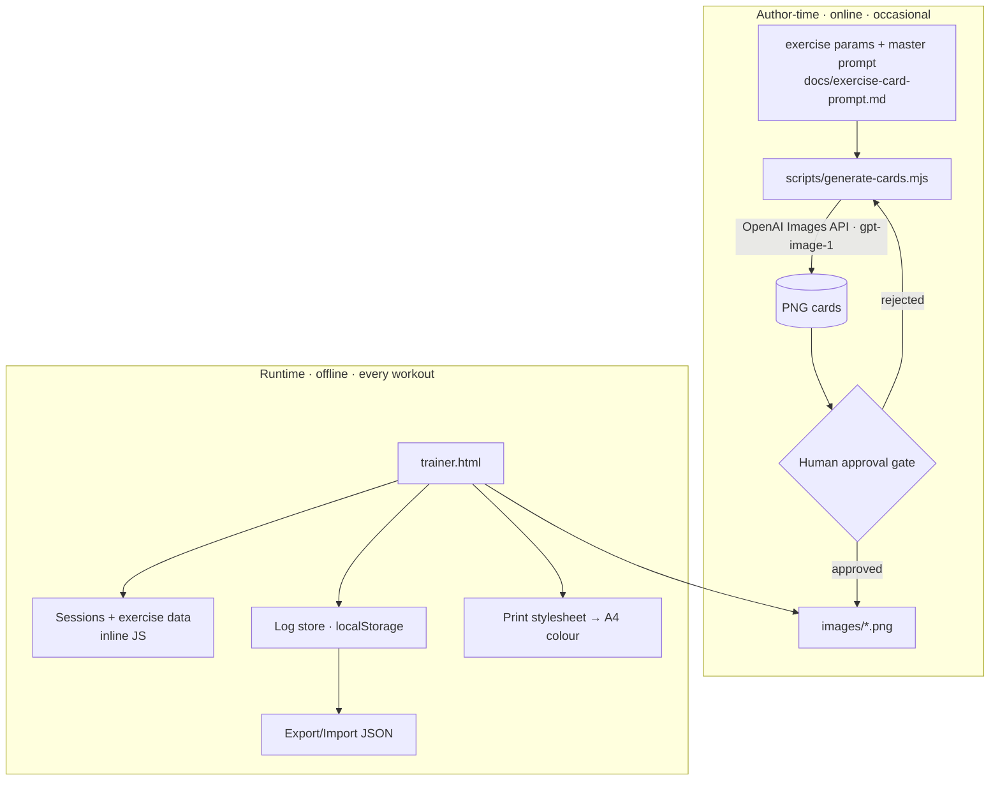

# PRD — Military Gentleman Trainer

## 1. Overview

- **Product name:** Military Gentleman Trainer
- **One-liner:** An offline `trainer.html` + `images/` folder that shows Ivan's exercises as premium AI-generated instructional cards, prints to A4, and logs completed workouts as accumulating evidence.
- **Objective:** Make an already-written home-training plan usable (understandable in ~3 seconds per card), printable, and self-documenting — offline at training time.
- **Differentiation:** His own routine as beginner-safe instructional cards, offline and history-keeping — versus generic exercise libraries.
- **Magic moment:** Open the app → understand today's session from the cards → tap done → history has grown.
- **Success criteria:** Trains from it 3–5×/week for an 8-week block; log exported at least once; every exercise card approved as correct/safe.

## 2. Technical Architecture

**Two phases — keep them separate:**
- **Author-time (occasional, online):** a Node script generates the exercise cards via the OpenAI Images API and saves approved PNGs to `images/`.
- **Runtime (every workout, offline):** `trainer.html` displays those PNGs, logs sessions to `localStorage`, and prints. No network, no key, no server.



**Stack table:**

| Layer | Choice | Notes |
|---|---|---|
| Runtime frontend | Vanilla HTML/CSS/JS (`trainer.html`) | No framework, no build step |
| Card assets | `images/*.png` | AI-generated, approved, offline |
| Storage | `localStorage` | Key `mgt.log.v1`; JSON export/import |
| Print | `@media print` stylesheet | A4 colour, one exercise per block |
| Generation (author-time) | `scripts/generate-cards.mjs` (Node) | Reads params + prompt, calls OpenAI |
| Image model | OpenAI `gpt-image-1`, square 1024² | Verify current pricing before batches |
| Secrets | `.env` (`OPENAI_API_KEY`), git-ignored | Never referenced by `trainer.html` |

**Integration guide:** Generation uses the OpenAI Images API (`POST /v1/images/generations`, model `gpt-image-1`). The runtime makes **zero** external requests. The master prompt and per-exercise briefs are the source of truth in `docs/exercise-card-prompt.md`.

**Repo structure:**
```
trainer.html                     # the offline app
images/                          # approved PNG cards, e.g. dead-bug.png
scripts/generate-cards.mjs       # author-time generation script (Node)
exercises.js (or inline)         # exercise + session data
docs/exercise-card-prompt.md     # master prompt + samples
.env                             # OPENAI_API_KEY (git-ignored)
.gitignore                       # ignores .env
```

**Infrastructure:** None at runtime. Distribution = copy `trainer.html` + `images/` (a folder) to any device. Runs via `file://` or direct open.

**Security:** `OPENAI_API_KEY` lives only in `.env`, used only by the Node script, never shipped to the browser. Runtime has no network calls and no PII beyond self-entered logs in `localStorage`. Do not add any `fetch`/CDN to `trainer.html`.

**Cost estimate:** Runtime $0. Generation: a few dollars per full ~24-card set via `gpt-image-1` (verify current pricing). Regeneration is occasional.

## 3. Data Model

Runtime data is inline JS + `localStorage`. No server entities.

**Exercise** (authored inline; card image produced author-time):
- `id` (string, kebab-case, e.g. `dead-bug`)
- `name` (string, e.g. "Dead Bug")
- `category` (enum: `warmup` | `mobility` | `strength`)
- `dose` (string — e.g. "2–3 sets × 12–15" or "30–40 sec")
- `image` (string — screen card, e.g. `images/dead-bug.webp`)
- `printImage` (string — hi-res PNG master for print, e.g. `images/dead-bug.png`)
- `videoUrl` (string, optional — demo video for the QR link)
- **Card generation metadata** (drives `scripts/generate-cards.mjs`, per `docs/exercise-card-prompt.md`):
  - `view` (enum: `side` | `front` | `side-ground-plane`)
  - `frames` (2 | 3)
  - `muscles` (string — e.g. "core, hip flexors")
  - `commonMistake` (string) / `correct` (string)
  - `cues` (string[] — ≤3, imperative)
  - `tempo` (string)
  - `primaryFault` (string) / `videoCandidate` (bool)
  - `approved` (bool) / `approvedNote` (string, optional)

**Plan** (data-driven; MVP ships one, structured so more can be added later):
- `id` (string, e.g. `foundation-v1`)
- `name` (string, e.g. "Foundation Plan v1")
- `source` (string, e.g. "military_gentleman_knowledge_base.html")
- `sessions` (Session[] — the plan's sessions)
- `progression` (ProgressionStage[] — the 8-week ramp)
- `startDate` (ISO 8601 — when Ivan began this plan; drives the this-week target)

**Session** (belongs to a Plan):
- `id` (e.g. `warmup` | `mobility` | `strength-a` | `strength-b`)
- `title` (string) / `purpose` (string) / `exerciseIds` (string[] — ordered; all ids must exist in the exercise library, which contains **only** knowledge-base exercises)

**ProgressionStage** (from the KB 8-week ramp):
- `weekFrom` / `weekTo` (int)
- `sets` (string) / `reps` (string) / `resistance` (string) / `note` (string)
- KB values: wk 1–2 → 2 sets, light band, learn the movement; wk 3–4 → 3 sets, same form; wk 5–6 → increase resistance only if technique is stable; wk 7–8 → toward 12–15 reps, perfect control.

_The active plan is tracked in `localStorage` (`mgt.activePlan`). Given `startDate` and today, the app computes the current week → current ProgressionStage → the target shown per exercise._

**LogEntry** (runtime, stored under `localStorage` key `mgt.log.v1`):
- `id` (string — timestamp-based) / `date` (ISO 8601) / `sessionId` (Session.id)
- `completed` (string[] — exercise ids ticked done) / `note` (string, optional)

**Log store shape:** `{ version: 1, entries: LogEntry[] }`.

## 4. Interfaces

No runtime server. Two internal surfaces:

**Runtime (browser JS over `localStorage`):**

| Function | Purpose |
|---|---|
| `loadLog()` | Read/parse `mgt.log.v1`; migrate/empty-init if absent. |
| `saveEntry(entry)` | Append a LogEntry, persist, handle quota errors. |
| `exportLog()` / `importLog(file)` | Download/parse the log JSON (validate shape/version; merge or replace). |
| `weekCount()` | Count entries in the current ISO week. |

**Author-time (`scripts/generate-cards.mjs`):**
- Reads the exercise list + `docs/exercise-card-prompt.md`, builds a filled prompt per exercise.
- Calls OpenAI Images API (`gpt-image-1`, square) — one exercise per request, **not batched**.
- **Consistency:** passes the approved reference figure (`images/_reference-figure.png`) as a reference input to every card so the character/style stays uniform. The reference figure is generated and approved first.
- **Outputs two files per card:** a hi-res PNG master (`images/<id>.png`, for print) and a downscaled WebP (`images/<id>.webp`, for screen).
- Writes `approved:false` until a human reviews; supports regenerating a single exercise by `--id`. Logs cost/errors.
- **Generation order is by session** (Strength A → Strength B → Warm-up → Mobility), each an approval batch, so a full trainable session is ready soonest.

## 5. User Stories

- As Ivan, I want each exercise shown as a clear instructional card so I understand it in seconds. *(AC: card shows start→movement→end, muscle highlight, mistake/correct, cues; renders offline from `images/`.)*
- As Ivan, I want to print a session as a clean A4 colour sheet so I can train away from the screen. *(AC: each exercise = card image + checkbox; no exercise splits across a page break.)*
- As Ivan, I want to tap exercises done and log the session so my record grows. *(AC: "Log session" saves a LogEntry; confirmation + week count update.)*
- As Ivan, I want to export my log so clearing my browser doesn't erase my evidence. *(AC: export downloads JSON; import restores it.)*
- As the author (me/Ivan), I want to generate and approve cards from the master prompt so the library is correct and consistent. *(AC: script produces a PNG per exercise; nothing enters the app until `approved:true`.)*

## 6. Functional Requirements

- **FR-001 (P0):** Four pre-built sessions selectable from a "Today" view.
- **FR-002 (P0):** Each exercise card renders its approved PNG from `images/` with no network. *AC: works offline; correct image per exercise.*
- **FR-003 (P1):** Optional QR to a demo video when `videoUrl` is present (cards without one show no QR).
- **FR-004 (P0):** Print an A4 colour session sheet via `@media print` with a checkbox per exercise; `page-break-inside: avoid` per card.
- **FR-005 (P0):** Tap-to-mark exercises done within a session.
- **FR-006 (P0):** Log a completed session to `localStorage`.
- **FR-007 (P0):** History view lists past LogEntries newest-first.
- **FR-008 (P0):** Export the log as a downloadable JSON file.
- **FR-009 (P0):** Import a log JSON (validate version/shape; merge-or-replace; inline error on bad file).
- **FR-010 (P1):** "This week" count on the Today view.
- **FR-011 (P0, author-time):** `generate-cards` script produces a PNG per exercise from the master prompt via `gpt-image-1`; one exercise per request.
- **FR-012 (P0, author-time):** Approval gate — an exercise's card is only used when `approved:true`; the app skips/█flags un-approved ones.
- **FR-013 (P1, author-time):** Regenerate a single exercise by `id` without touching the others.
- **FR-014 (P2):** Simple progress view (sessions-per-week over time).
- **FR-015 (P1):** Progression display — from the active plan's `progression` + `startDate`, compute the current week and show this week's target (sets/reps/resistance) on the Today and Session views. *AC: week 1 shows "2 sets, light band"; changing `startDate` changes the stage.*
- **FR-016 (P1):** Data-driven plans — sessions/exercises/progression are read from a Plan object; the active plan id is stored in `localStorage`. MVP ships one plan (`foundation-v1`); the structure must allow adding another plan object later with no code change to the runtime. *AC: swapping the active plan id would switch sessions + progression (even if only one plan exists at launch).*

## 7. Non-Functional Requirements

- **Offline runtime:** Zero network requests when training. No CDN, no external calls from `trainer.html`. *Verify: load with network disabled; DevTools Network tab empty.*
- **Performance:** App interactive in <1s; each card PNG optimized to keep the `images/` folder reasonable (target ≤ ~400–600 KB/card; downscale/compress as needed).
- **Portability:** `trainer.html` + `images/` works in current Chrome/Safari/Firefox on desktop and mobile via `file://` or direct open; the folder copies as a unit.
- **Print:** A4 colour; each card readable at arm's length; no exercise split across pages.
- **Durability:** No log loss on reload; export/import round-trips losslessly; graceful `QuotaExceededError`.
- **Accessibility:** Card `` has descriptive `alt` (exercise name + "instructional card"); tap targets ≥ 44 px; legible contrast.
- **Content safety (governance):** Every card human-approved against a known-good source before use; regeneration keeps the same visual standard.

## 8. UI/UX Requirements

- **Today view:** Active plan name + **this week's target** (e.g. "Week 2 · 2 sets, light band"), session picker (four cards), "this week" count, links to History and Export/Import. *Empty log: "No workouts yet — pick a session to begin."* *(If no plan `startDate` is set yet, prompt "Set your start date" to begin week tracking.)*
- **Session view:** Ordered exercise cards (the AI card image + name + dose + optional QR), a done-toggle per card, "Print sheet" and "Log session" buttons.
- **History view:** Reverse-chronological list; each row date + session + N/total. *Empty: "Your logged sessions will appear here."*
- **Print layout:** Field-manual style — session title, date line, one exercise per block (card image + checkbox); hide nav/buttons.
- **States:** empty (no log), populated, import-error (inline message), quota-exceeded (prompt to export then clear), missing/un-approved card (placeholder + note, never a broken image).
- Design tokens come from `docs/design.md` (Field Manual — calm, light, system fonts). Card visual language + generation prompt: `docs/exercise-card-prompt.md`.

## 9. Auth Implementation

None. Single-user local tool; no accounts.

## 10. Payment Integration

None in the app. Generation incurs OpenAI API cost (author-time), billed to the user's OpenAI account via the `.env` key.

## 11. Edge Cases & Error Handling

- **localStorage full/unavailable:** Catch `QuotaExceededError`/private-mode; "Couldn't save — export your log and clear old entries." Never lose the in-memory session.
- **Corrupt/old log JSON:** Keep a backup in memory, start empty, warn; don't overwrite the bad blob until the user acts.
- **Import wrong shape/version:** Reject with inline message; merge/replace only on valid files.
- **Missing or un-approved card image:** Show a labelled placeholder ("card pending approval"), not a broken image.
- **Print with a large session:** `page-break-inside: avoid` per card.
- **Generation failures (author-time):** Script retries once, logs the error and cost, and leaves the previous approved card untouched.

## 12. Dependencies & Integrations

- **OpenAI Images API** (`gpt-image-1`) — author-time only, via the Node script; needs `OPENAI_API_KEY` in `.env`.
- **OpenAI Node SDK** (or `fetch`) in `scripts/generate-cards.mjs`.
- **Content source:** `military_gentleman_knowledge_base.html` (names, cues, doses, sessions) and `docs/exercise-card-prompt.md` (card briefs).
- No third-party code, fonts, or services in the runtime.

## 13. Out of Scope

AI plan generation; a UI to author/manage multiple plans (MVP ships one plan object, structured so more can be added later); any exercise not in the knowledge base; runtime backend; accounts; cloud sync; notifications; analytics; native app; in-app/on-demand card generation (author-time only); monthly assessment charts (P2).

## 14. Resolved Decisions

1. **Consistency → fixed reference image.** Generate + approve one canonical figure first (`images/_reference-figure.png`); pass it as a reference input to every card.
2. **QR → kept.** Each card keeps an optional QR to a demo video (FR-003).
3. **Format → PNG master + WebP screen.** Generate hi-res; keep the PNG for print sharpness and a downscaled WebP for on-screen to keep `images/` light.
4. **Generation order → by session.** Strength A → Strength B → Warm-up → Mobility, each an approval batch, so a complete trainable session lands first.
5. **Billing note.** Generation uses the OpenAI **platform API** (pay-as-you-go, a few dollars total) — **not** covered by ChatGPT Plus. Key lives in `.env`, author-time only.

6. **Strength A/B split → derived from KB purposes.** A = push/pull/squat/core: Chest Press, Row, Bodyweight Squat, Dead Bug, Front Plank. B = shoulders/back/legs/core: Overhead Press, Face Pull, Lat Pulldown, Reverse Lunge, Romanian Deadlift, Side Plank. (Bird-Dog removed — not in the KB.) Ivan can still re-sort when authoring the data.
7. **Plans are data, MVP ships one.** `foundation-v1` from the KB; multi-plan authoring/AI generation is out of scope, but the runtime reads a Plan object so a future plan is a data add, not a rebuild.
